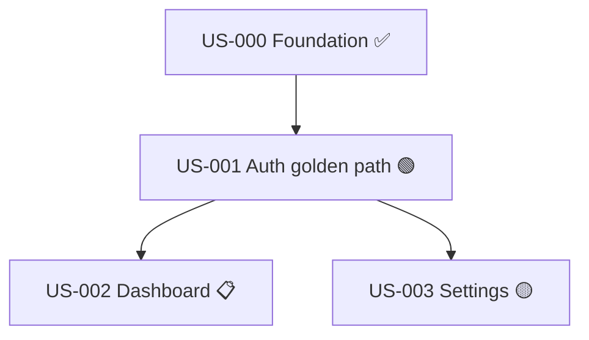

# `specs/STORIES.md` Template

`specs/STORIES.md` is the **human-readable kanban index** of the project. It is regenerated **deterministically** from `specs/stories.json` on every `phase` transition by `scripts/regen_stories_md.py` (the canonical script ships with this skill). Manual edits are tolerated but will be overwritten — change the JSON, not the markdown.

> **This file is reference / documentation.** The script is the source of truth for what STORIES.md looks like; this template documents the layout for humans reading the schema. Don't hand-render unless the script can't run (e.g., Python missing on the host); even then, prefer fixing Python over hand-rendering.

The file has three sections: a header, a single kanban table grouped by `phase`, and a dependency view. It is intentionally short; per-story detail belongs in each story's `STORY.md`.

---

## Template

```markdown
# Stories — <Project Name>

_Regenerated from `specs/stories.json` on <YYYY-MM-DD>. Manual edits will be overwritten._

**Project phase summary:** N verified · N green · N red · N planned · N specced · N scoped · N backlog (out of N total)

## Kanban

### ✅ Verified

| ID     | Title                          | Epic   | Priority   | Depends on                   | Verified |
| ------ | ------------------------------ | ------ | ---------- | ---------------------------- | -------- |
| US-000 | Foundation: walking skeleton   | E-001  | must-have  | —                            | 2026-05-04 |

### 🟢 Green (awaiting verification)

| ID     | Title                          | Epic   | Priority   | Depends on  |
| ------ | ------------------------------ | ------ | ---------- | ----------- |
| US-001 | User auth golden path          | E-001  | must-have  | US-000      |

### 🔴 Red (tests written, awaiting implementation)

| ID     | Title                          | Epic   | Priority   | Depends on  |
| ------ | ------------------------------ | ------ | ---------- | ----------- |

### 📋 Planned (PLAN.md ready)

| ID     | Title                          | Epic   | Priority   | Depends on  |
| ------ | ------------------------------ | ------ | ---------- | ----------- |
| US-002 | Dashboard with stat cards      | E-002  | should-have | US-001     |

### 📝 Specced (STORY.md + features ready)

| ID     | Title                          | Epic   | Priority   | Depends on  |
| ------ | ------------------------------ | ------ | ---------- | ----------- |

### 🟡 Scoped (in backlog, INVEST-checked)

| ID     | Title                          | Epic   | Priority   | Depends on  |
| ------ | ------------------------------ | ------ | ---------- | ----------- |
| US-003 | Account settings + edge cases  | E-003  | could-have | US-001      |

### ⚪ Backlog

| ID     | Title                          | Epic   | Priority   |
| ------ | ------------------------------ | ------ | ---------- |
| US-004 | Multi-tenant org switching     | E-004  | could-have |

## Dependency view



## Epics

| Epic   | Title                | Stories                          | Priority    |
| ------ | -------------------- | -------------------------------- | ----------- |
| E-001  | Auth & onboarding    | US-000, US-001                   | must-have   |
| E-002  | Dashboard            | US-002                           | should-have |
| E-003  | Account management   | US-003                           | could-have  |
| E-004  | Multi-tenant         | US-004                           | could-have  |
```

---

## Rules for the regenerator

- Phases that have zero stories: print the heading + an empty table (preserves visual structure when scanning).
- The `Verified` table includes a `Verified` date column drawn from `stories[i].verification.verified_at`.
- The `Backlog` table omits the `Depends on` column (dependencies are not enforced for backlog items).
- The `Dependency view` Mermaid graph includes only stories whose `phase ∉ {backlog}`. Verified stories are marked with ✅, green with 🟢, etc.
- The `Epics` table lists every epic from `epics[]` with its stories joined by `, `.
- Story rows are sorted by ID ascending within each phase group.
- The `Project phase summary` line is computed from the full `stories[]` array.
- The header timestamp uses `project.updated_at`.
