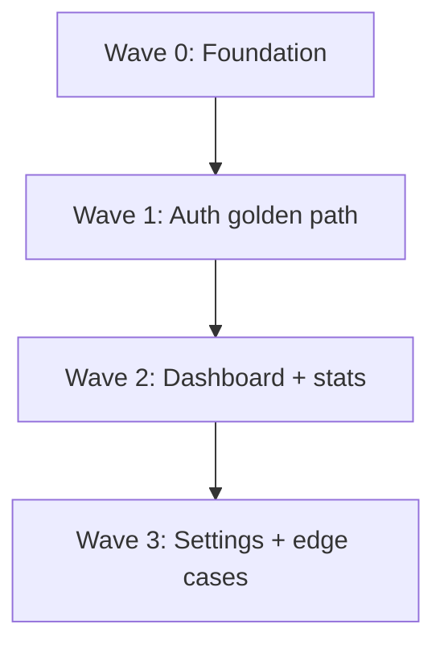

# Plan Writing

Plans the implementation of **one version at a time** (V0, V1, V2, ...) — not the
whole app. Reads the version's user stories from `project-tracking.json`, their specs
from SPECS.md / `.feature` files, and the architecture from ARCHITECTURE.md, then
produces a **DAG of implementation plans** organized into **vertical-slice waves**.

**Key principle: every wave produces a testable, end-to-end working app.** Waves are
not horizontal layers (don't build all the backend first, then all the frontend).
Each wave adds a complete, thin vertical slice that can be run and tested end-to-end.

The core outputs:

1. **`docs/V{N}/plans/00-foundation.md`** — shared infrastructure plan for this version (wave 0)
2. **`docs/V{N}/plans/WN-<slug>.md`** — one plan per vertical-slice wave
3. **`docs/V{N}/plans/DAG.md`** — the dependency graph with waves
4. **Updated `project-tracking.json`** — planning status for the version

## Integration with project-tracking.json

**`project-tracking.json` is the single source of truth.** This skill reads from it and writes back.

### Reading from project-tracking.json

1. Read `docs/project-tracking.json`
2. Identify the **target version** — the user must specify which version to plan (V0, V1, ...)
3. Extract the version's `user_story_ids` from `roadmap.versions`
4. Look up each user story in `epics` — get the full story with acceptance criteria
5. Check each story's `spec` field — if it has a `feature_file`, read that `.feature` file
6. Read `architecture.modules` (high-level) and `architecture.detailed_modules` (MIM AA) if available
7. Read `personas` for context on user goals

**If a story doesn't have a `spec` field yet** (no feature file), tell the user to run
`/spec-writing` for this version first. Specs and feature files are required for TDD planning.

### Writing back to project-tracking.json

After generating plans, update `project-tracking.json` (read-merge-write):

- Add `planning` field to the target version in `roadmap.versions`:
  ```json
  {
    "id": "V{N}",
    "...existing fields...": "",
    "planning": {
      "status": "planned",
      "plan_dir": "docs/V{N}/plans/",
      "dag_file": "docs/V{N}/plans/DAG.md",
      "waves_count": 4,
      "total_tasks": 18,
      "planned_at": "2026-04-07"
    }
  }
  ```
- Update `project.updated_at`

---

## Prerequisites

These must exist:

| Source                                   | What's needed                | Produced by                |
| ---------------------------------------- | ---------------------------- | -------------------------- |
| `docs/project-tracking.json`             | Version with user_story_ids  | /high-level-scoping        |
| User stories with `spec` field           | Feature files for each story | /spec-writing              |
| `docs/V{N}/specs/features/*.feature`     | Gherkin scenarios for TDD    | /spec-writing              |
| `docs/V{N}/architecture/ARCHITECTURE.md` | MIM AA module design         | /research-and-architecture |
| `docs/V{N}/specs/UI-SPECS.md`            | Design tokens (if UI)        | /spec-writing              |
| `docs/V{N}/specs/UI-F-*.md` + wireframes | Screen specs (if UI)         | /spec-writing              |

If any required file is missing, stop and tell the user which skill to run.

**Scaffolded repo is NOT required.** Plans can be written before `/repo-initialization`.
The repo will be scaffolded after plans are approved.

---

## Asking Which Version to Plan

If the user didn't specify a version, use AskUserQuestion:

- **Header: "Version"** — "Which version do you want to plan?"
  - Options: one per version from `roadmap.versions` (e.g., "V0 — Walking Skeleton", "V1 — Core Features")
  - Include the version's `goal` and number of user stories in the description

---

## Phase 1: Read Inputs (Scoped to Version)

Read **only** what's relevant to the target version:

**From project-tracking.json:**

- The version's user stories (full details from epics)
- Personas involved
- Architecture modules

**From each user story's `.feature` file:**

- All Rules and Scenarios
- Entities referenced (data models, services, UI components)
- Given/When/Then step patterns

**From ARCHITECTURE.md:**

- Module map — which BM/Infra-Module owns which features
- Module internal structure
- Dependency graph between modules
- Data ownership, communication patterns
- Testing strategy per module

**From UI specs (if applicable):**

- Design system tokens
- Per-screen wireframes, layouts, components

---

## Phase 2: Vertical Slice Analysis

**This replaces the old feature-dependency DAG.** Instead of organizing by feature
dependencies, organize by **vertical slices** — each slice is a thin end-to-end
path through the app that delivers testable user value.

### Step 1: Map User Stories to End-to-End Paths

For each user story in the version, identify the **end-to-end path** it requires:

| User Story | UI Screen  | API/Route        | Service Logic          | Data Layer      | External       |
| ---------- | ---------- | ---------------- | ---------------------- | --------------- | -------------- |
| US-001     | Login page | POST /auth/login | AuthService.login      | users table     | OAuth provider |
| US-003     | Dashboard  | GET /dashboard   | DashboardService.stats | cards, sessions | —              |

### Step 2: Identify the Thinnest Vertical Slice (Wave 1)

The first wave after foundation should be the **thinnest possible end-to-end slice**
that proves the architecture works and delivers the most critical user value:

- Pick the single most important user story (highest priority, most critical path)
- Trace its end-to-end path: UI → API → Service → Data
- This becomes Wave 1 — the "walking skeleton within the version"

### Step 3: Group Remaining Stories into Vertical Waves

Group the remaining stories into waves where:

1. **Each wave adds a complete vertical slice** — not just backend or just frontend
2. **Each wave builds on previous waves** — Wave N can use what Wave N-1 built
3. **Each wave produces a testable app** — after implementing Wave N, you can run the app and test all Wave 0..N functionality end-to-end
4. **Stories that share infrastructure go together** — if US-005 and US-006 both need the same new service, put them in the same wave
5. **Prefer fewer, meatier waves over many thin ones** — 3-4 waves per version is ideal

### Step 4: Build the DAG

The DAG is simpler than before — it's a linear chain of waves with internal parallelism:

```
Wave 0: Foundation (infrastructure for this version)
    ↓
Wave 1: [Thinnest vertical slice — 1-2 stories, end-to-end]
    ↓
Wave 2: [Next slice — 2-3 stories, adds a workflow]
    ↓
Wave 3: [Polish slice — remaining stories, edge cases, error handling]
```

**Within a wave**, tasks are organized by story, and stories that don't depend on
each other can be executed in parallel by separate agents.

### Step 5: Validate — Each Wave Is End-to-End

For each wave, verify:

- [ ] It touches all necessary layers (UI + logic + data) for its stories
- [ ] After this wave completes, you can start the app and manually test the new functionality
- [ ] It doesn't leave dangling half-implementations (e.g., API endpoint without UI, or UI without backend)
- [ ] BDD scenarios for this wave's stories will all pass

---

## Phase 3: Write the Foundation Plan (Wave 0)

The foundation plan covers **only the shared infrastructure needed by this version's
stories** — not the entire app's infrastructure. Read `references/plan-template.md`.

### How to Scope Foundation for a Version

Scan the version's feature files and extract shared needs:

1. **Database schema** — only entities referenced by this version's stories. If V0 has
   3 stories touching `users` and `cards`, only set up those tables.
2. **Shared types and constants** — only what this version needs.
3. **Database connection and utilities** — ORM setup, migration runner.
4. **BM service skeletons with DI interfaces** — only for Business-Modules involved
   in this version. Create the service class with interfaces, so Wave 1 can write
   tests against them immediately.
5. **Test infrastructure** — database seeding, fixtures, fakes for this version's modules.

### Foundation TDD

Same as before — even foundation follows RED-GREEN-REFACTOR:

- Unit tests for shared utilities
- Integration tests for repository CRUD against real DB
- Sociable unit tests for BM services with fakes

Save to `docs/V{N}/plans/00-foundation.md`.

---

## Phase 4: Write Wave Plans

Write one plan per wave (after foundation). Each wave plan covers **all stories in
that wave**, organized as tasks.

### For Each Wave Plan

Read `references/plan-template.md` for the template. Then:

1. **List the user stories in this wave** with their feature files
2. **For each story**, group its Gherkin Rules into tasks
3. **Order tasks within the wave for vertical completeness:**
   - For each story in the wave, interleave layers:
     1. Data access + service logic (BM + Infra)
     2. API/route wiring (entrypoint)
     3. UI components (following wireframes)
   - Don't do all data layers first, then all APIs — complete each story vertically
4. **Mark which tasks within the wave are parallelizable** — stories that don't share
   services can be implemented in parallel by separate agents

### Task Structure (Steps-First TDD)

**Every task in every plan MUST prescribe this exact execution order:**

```
Task N: [Name]
  Story: US-NNN
  ├── 1. RED-A: Write BDD step definitions
  │       → Create/update step file in e2e/steps/ or features/steps/
  │       → Bind Given/When/Then patterns to code-under-test (which doesn't exist yet)
  │       → Run BDD tests → they MUST FAIL
  │       → Commit: test(<scope>): add BDD steps for <scenario>
  │
  ├── 2. RED-B: Write unit/integration tests
  │       → Create test file co-located with the module
  │       → Assert behaviors from the Gherkin scenarios
  │       → Use hand-written fakes for BM sociable unit tests
  │       → Use real DB for infra integration tests
  │       → Run tests → they MUST FAIL
  │       → Commit: test(<scope>): add failing test for <scenario>
  │
  ├── 3. GREEN: Write minimal implementation
  │       → Write the simplest code that makes ALL tests pass
  │       → Place code in the correct module from ARCHITECTURE.md
  │       → For UI: follow wireframes from docs/V{N}/specs/wireframes/ + design tokens
  │       → Run full test suite → ALL must pass (no regressions)
  │       → Commit: feat(<scope>): implement <what>
  │
  └── 4. REFACTOR (if needed)
          → Clean obvious duplication, improve names
          → Ensure module boundary compliance
          → Run full test suite → still passes
          → Commit: refactor(<scope>): <what>
```

**This order is non-negotiable.**

### Task Descriptions Must Include

| Field                 | What to write                                    | Why it matters                    |
| --------------------- | ------------------------------------------------ | --------------------------------- |
| **Story**             | US-NNN from project-tracking.json                | Traceability to backlog           |
| **Module**            | Which module from ARCHITECTURE.md                | Agent knows where to create files |
| **What**              | One sentence deliverable                         | Quick scan                        |
| **Scenarios covered** | Exact scenario names from .feature file          | Traceability to specs             |
| **UI spec**           | Reference to wireframe PNG + UI-F-\*.md (or N/A) | Agent knows the visual target     |
| **RED-A: BDD steps**  | Which step patterns, which file, which bindings  | Agent writes steps first          |
| **RED-B: Tests**      | Which behaviors, test type, which fakes          | Agent writes tests second         |
| **GREEN: Implement**  | Which files, how it connects                     | Agent implements third            |
| **Verify**            | Exact command to run                             | Agent confirms the task is done   |

### Wave-End Verification

Each wave plan MUST end with a **wave verification section**:

```markdown
## Wave N Verification

After all tasks in this wave are complete:

1. Run full test suite: `[command]`
2. Start the app: `[command]`
3. Manually verify these end-to-end flows:
   - [ ] [Describe flow 1 from US-NNN: user does X, sees Y]
   - [ ] [Describe flow 2 from US-NNN: user does X, sees Y]
4. Run BDD suite for this wave's scenarios: `[command]`

The app should be fully functional for all Wave 0..N stories after this wave.
```

### Save Wave Plans

Save each to `docs/V{N}/plans/W1-<slug>.md`, `docs/V{N}/plans/W2-<slug>.md`, etc.

The slug should describe the slice, e.g.:

- `W1-auth-golden-path.md`
- `W2-dashboard-and-stats.md`
- `W3-settings-and-edge-cases.md`

---

## Phase 5: Write DAG.md

Create `docs/V{N}/plans/DAG.md` as the human-readable execution map:

````markdown
# Implementation DAG — Version [VN]

**Version goal:** [goal from project-tracking.json]
**User stories in scope:** [list US-NNN IDs]
**Total waves:** N (foundation + N-1 vertical slices)

## Wave Overview

| Wave | Name             | Stories                | What becomes testable                   | Parallel agents |
| ---- | ---------------- | ---------------------- | --------------------------------------- | --------------- |
| 0    | Foundation       | —                      | DB + services skeleton                  | 1               |
| 1    | [Thinnest slice] | US-001, US-003         | [User can do X end-to-end]              | 2               |
| 2    | [Next slice]     | US-005, US-006, US-007 | [User can also do Y and Z]              | 3               |
| 3    | [Polish]         | US-008                 | [Edge cases, error states, full polish] | 1               |

## Dependency Graph


````

## Parallel Execution Guide

Each wave's independent stories can be dispatched to separate agents simultaneously.
Wait for ALL tasks in a wave to complete before starting the next wave.

**After each wave:** run the wave verification checklist from the plan. The app
must be functional for all stories implemented so far.

```

---

## Phase 6: Update project-tracking.json

Read the existing file, merge in:
- Add `planning` field to the target version
- Update `project.updated_at`

---

## Phase 7: Report

1. **Verify all plan files exist** on disk in `docs/V{N}/plans/`
2. **Report to user:**
   - Version planned: VN
   - Total waves: N
   - Total tasks across all waves: M
   - Stories covered: list US-NNN
   - Each wave summary: what becomes testable
3. **Use AskUserQuestion for next step:**
   - **Header: "Next"** — "Plans for [VN] are ready. What's next?"
     - "Run plan verification (Recommended)" — description: "Launch /plan-writing-verification to audit the plans"
     - "Start implementing" — description: "Begin with /spec-implementation or manual development"
     - "Scaffold the repo first" — description: "Run /repo-initialization before implementing"
     - "Adjust the plans" — description: "I want to change something before proceeding"

---

## Key Design Principles

### Version-Scoped, Not App-Wide

Don't plan the entire app. Plan one version at a time. V0's plan should be small
and fast to implement. V1's plan builds on V0's codebase.

### Waves Are Vertical Slices, Not Horizontal Layers

**Wrong:** Wave 1 = all database, Wave 2 = all API, Wave 3 = all UI.
**Right:** Wave 1 = login flow (DB + API + UI), Wave 2 = dashboard flow (DB + API + UI).

Each wave delivers testable end-to-end functionality.

### Plans Are for Parallel Agents

Each wave plan is a self-contained work package. Within a wave, independent stories
can be dispatched to separate agents. The plan contains everything the agent needs.

### Plans Are Dry (Zero Code)

Plans describe *what* to build and *what to test*, never *how*. If you find yourself
writing actual code in a plan — stop. Describe the component, don't implement it.

### TDD Is Non-Negotiable

Every task prescribes: BDD steps first, unit tests second, implementation third.
The RED-GREEN-REFACTOR cycle is explicit in every task.

### Architecture Compliance Is Baked In

Every task specifies which MIM AA module the code belongs to. This prevents
misplaced logic, cross-module foreign keys, or internal imports.

### One Rule ≈ One Task

The Gherkin `Rule:` block is the natural unit of work. Each Rule groups related
scenarios (happy + sad + edge). One Rule maps to one task by default.
```
