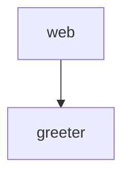

# Architecture

## Modules

| Module | Responsibility | Depends on |
|---|---|---|
| greeter | builds greetings | — |
| web | serves the page | greeter |

## Dependency graph

## ADRs

### ADR-001 — Plain Node, no framework

The project is small enough to serve with `node:http`.

